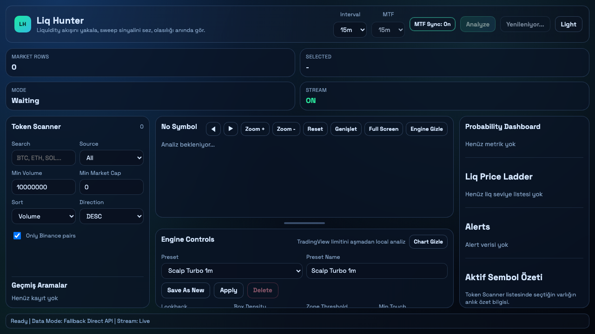
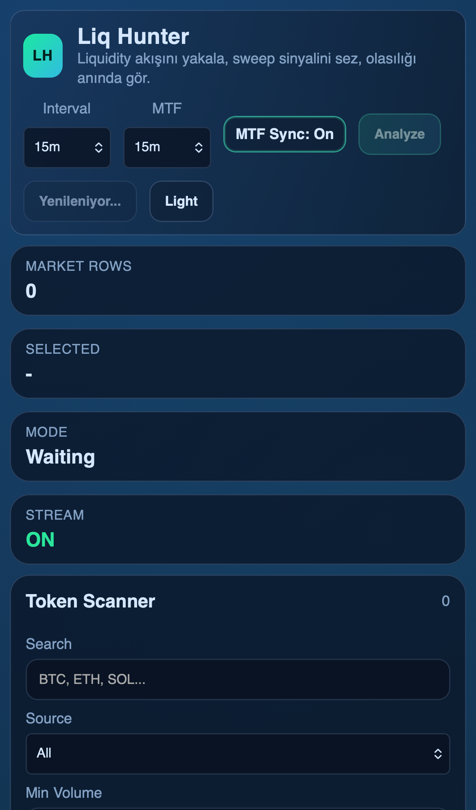

# Liq Hunter Desktop

Liq Hunter, Pine Script tarafındaki zaman limiti kısıtını (`The script takes too long to execute`) aşmak için aynı likidite/probability mantığını Electron masaüstüne taşıyan uygulamadır.

Bu repo, **kaynak kod paylaşmadan** yalnızca:
- ürün dokümantasyonu,
- ekran görüntüleri,
- indirilebilir release dosyaları
için kullanılacak şekilde hazırlanmıştır.

## Öne Çıkan Özellikler

- Binance Spot + Binance Futures + CoinGecko + CoinMarketCap birleşik market snapshot
- Futures-only token görünürlüğü (örn. `SIRENUSDT`, `ARIAUSDT` gibi spotta olmayan ama futures'ta işlem gören semboller)
- Token Scanner: arama, kaynak, minimum hacim, minimum market cap, sıralama ve yön filtreleri
- Liq Hunter kutuları + Liq Price Ladder + fiyat/likidite yoğunluk seviyeleri
- Probability Engine (bull/bear bias, PD zone, session, sweep, rejection)
- MTF analiz ve live WebSocket kline akışı
- Alert tetiklerinde Desktop Notification + Sound Alert
- Alert önizleme (notification preview + sound preview)
- Preset yönetimi (institutional preset seti + custom preset kaydet/uygula/sil)
- Chart araçları: zoom, pan, fullscreen, chart/engine hide, split-resize
- Dark / Light mode
- Arama geçmişi

## Ekran Görüntüleri

### Desktop



### Mobile / Responsive



## Release Dosyaları

`release/` klasöründe doğrulanmış (zip integrity test başarılı) dosyalar:

- `Liq Hunter-1.0.0-arm64-mac.zip`
- `Liq Hunter-1.0.0-win.zip` (Windows x64)
- `Liq Hunter-1.0.0-arm64-win.zip` (Windows ARM64)

GitHub Release:

- [v1.0.0-test](https://github.com/WeAreTheArtMakers/liqhunter/releases/tag/v1.0.0-test)
- `Liq.Hunter-1.0.0-arm64-mac.zip`
- `Liq.Hunter-1.0.0-win.zip`
- `Liq.Hunter-1.0.0-arm64-win.zip`

## Çalıştırma ve Build

```bash
npm install
npm run dev
```

```bash
npm run build
```

Mac zip:

```bash
npx electron-builder --mac zip
```

Windows zip:

```bash
npx electron-builder --win zip --x64
npx electron-builder --win zip
```

## 30 Gün Deneme + Üyelik Sistemi (Tasarım)

Bu sürüm test dağıtımı için planlanmıştır. Üretim üyelik modeli için önerilen yapı:

1. **Device activation**
   - İlk açılışta cihaz parmak izi + lisans kaydı
   - Sunucudan `trial_start` ve `trial_end` (30 gün) doğrulaması
2. **Lisans doğrulama katmanı**
   - Signed JWT / kısa TTL access token
   - Offline grace period (örn. 24-48 saat)
3. **Paket planları**
   - Starter (kısıtlı symbol + gecikmeli stream)
   - Pro (tam canlı stream + tüm preset + bildirim)
   - Team (çoklu cihaz + yönetim paneli)
4. **Ödeme & abonelik**
   - Stripe (webhook tabanlı `subscription.created/updated/canceled`)
5. **Uygulama içi erişim kontrolü**
   - Feature flags (market data scope, max alert, preset count, export)
6. **Güvenlik**
   - Preload bridge + IPC allowlist
   - API anahtarlarını renderer yerine main/backend tarafında tutma

## Not

- CoinMarketCap free-plan API key uygulamaya gömülü kullanılabilir; istenirse `CMC_API_KEY` ile override edilebilir.
- Trading analizleri Binance verisi üzerinden lokal hesaplanır.
