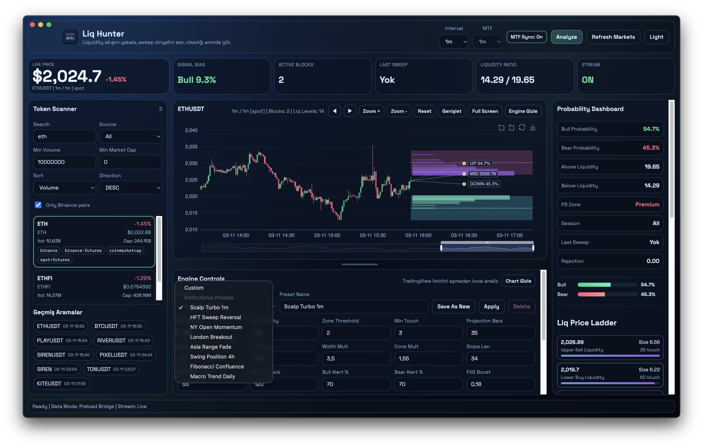

# Liq Hunter Desktop

Liq Hunter Desktop is an Electron-based trading workstation for liquidity mapping, probability scoring, and real-time market monitoring without TradingView script execution limits.

## Screenshot Tour

### Main Trading Workspace


### Full-Screen Chart Mode


### Fast 1m Monitoring Layout


### Probability + Liquidity Dashboard


### Ladder + Focus Interactions


### Membership Settings Modal


## What Liq Hunter Does

- Scans markets from Binance Spot, Binance Futures, CoinGecko, CoinMarketCap.
- Adds commodity support with free data feed for **WTI/XTI equivalent** (`WTI`, aliases: `XTI`, `USOIL`, `XTIUSD`, `WTIUSD`).
- Draws liquidity zones/levels and probability cone projections.
- Streams real-time Binance klines (WebSocket) for crypto symbols.
- Triggers desktop + sound alerts for sweep/probability events.
- Supports institutional-style presets and custom profile saving.
- Adds **Workspace Presets** (`Trader`, `Analyst`, `Minimal`) for one-click panel layouts.
- Keeps **View menu checkboxes in sync** with UI panel visibility (two-way sync).
- Stores view/workspace preferences per account (cross-device sync when license server is enabled).
- Uses a dedicated **Membership modal** so Engine Controls stay clean during analysis.

## Server-Side Licensing (Node + PostgreSQL)

This repo now includes a dedicated backend at `license-server/` with:

- Server-side trial and paid plan control
- Ed25519 signed, time-limited, one-time admin override tokens
- Token binding to account + device + IP
- MFA-protected admin login (password + TOTP)
- Full audit logging for sensitive actions
- Global kill switch and per-account/per-license revoke
- IBAN and crypto webhook confirmation endpoints

Desktop app connection:

- Set `LICENSE_SERVER_URL=http://localhost:4010`
- Optional hard-enforcement: `LICENSE_SERVER_STRICT=1` (disables local fallback on server errors)

## UI Manual (Complete)

## 1) Top Bar (Execution Controls)

- `Interval`: Main chart timeframe for active symbol (1m to 1d).
- `MTF`: Higher/lower timeframe used by the engine’s multi-timeframe model.
- `MTF Sync: On/Off`: When ON, `MTF` follows `Interval`.
- `Workspace`: Select `Trader`, `Analyst`, `Minimal`, or `Custom` panel layout.
- `Analyze`: Runs analysis immediately using current Engine Controls.
- `Refresh Markets`: Refreshes scanner rows from all enabled data providers.
- `Light/Dark`: Toggles app theme.
- `Membership`: Opens membership activation and billing details modal.

## 2) Live Metrics Strip (Read-Only Monitoring)

These are **observable metrics** for situational awareness:

- `Live Price`: Current traded price of selected symbol.
- `Signal Bias (Bull/Bear %)`: Difference between bull and bear probabilities.
  - Use to quickly identify directional pressure.
- `Active Blocks`: Number of currently active liquidity blocks.
  - More blocks = denser liquidity map.
- `Last Sweep`: Latest sweep state (`Upper`, `Lower`, or `Yok`).
  - Use to detect stop-hunt behavior.
- `Liquidity Ratio (Below / Above)`: Relative liquidity weight under vs above price.
  - Higher below value can indicate stronger downside magnet.
- `Stream (ON/OFF)`: Live update status.
  - ON = real-time data updates (for Binance symbols).

These cards are not direct order buttons; they are decision context.

## 3) Token Scanner (Left Panel)

- `Search`: Symbol/name filtering.
- `Source`: Filter rows by `All`, `Binance`, `CoinGecko`, `CoinMarketCap`, `Commodity (WTI/XTI)`.
- `Min Volume` / `Min Market Cap`: Reduce noise.
- `Sort` / `Direction`: Rank by volume, cap, change, symbol.
- `Only Binance pairs + WTI`: Keep tradeable Binance assets and WTI row.
- Symbol card tags:
  - `binance`, `binance-futures`, `coingecko`, `coinmarketcap`, `commodity`, etc.
  - `spot+futures` helps identify symbols tradable on both Binance markets.

## 4) View Menu + Workspace Presets

- `View` menu checkboxes control panel visibility:
  - Token Scanner
  - Search History
  - Probability Dashboard
  - Engine Controls
  - Membership Panel
  - Trial Banner
- Two-way sync:
  - If you hide/show panels from UI actions, menu checkmarks update automatically.
  - If you toggle from the menu, UI updates instantly.
- Workspace presets:
  - `Trader`: chart-focused layout with essential execution context.
  - `Analyst`: full panel visibility for research mode.
  - `Minimal`: chart-first minimal UI.
  - `Custom`: auto-detected when you manually change panel visibility.

## 5) Chart Panel (Center)

### Core Controls

- `◀ / ▶`: Pan visible zoom window left/right.
- `Lv - / Lv +`: Move focus to previous/next liquidity level.
- `Zoom + / Zoom -`: Tighten/expand zoom window.
- `Reset`: Reset zoom to default window.
- `Genişlet / Standart`: Expand chart column and revert layout.
- `Full Screen`: Dedicated full-screen chart mode.
- `Engine Gizle / Engine Aç`: Temporarily hide/show Engine Controls.

### Liquidity Focus Row

- `Max Liquidity`: Strongest level currently detected.
- `Liquidity Focus`: Shows hovered/clicked level + size + touches.
- `Prev Lv / Next Lv`: Quick stepper between levels.
- `Single Level`: Focus one selected level.
- `Show Side` / `Show Focus Side`: Restrict to same side (upper/lower) of focus.
- `Show Both Sides`: Re-enable both upper and lower.
- `Ghost 10%`: Keep non-focused lines visible with 10% opacity instead of hiding.
- `Auto Pan: On/Off`: Auto-shift zoom to keep focused level area visible.
- `Clear Focus`: Remove selected/hovered focus state.

### Focus State Styling

- `Sticky Tag`: Focused level has a fixed right-axis label (`FOCUS price`).
- `Sweep/Broken Highlight`: Focused level changes color and pulse animation when:
  - Sweep detected
  - Level broken

## 6) Liq Price Ladder (Right Panel)

`Liq Price Ladder` lists strongest levels with size and touch count.

- `Show All`: Clears focus and shows all relevant levels.
- `Prev Lv` / `Next Lv`: Moves focus up/down level rank.
- `Show Focus Side` / `Show Both Sides`: Side isolation toggle.
- `Ghost 10%`: Enables ghost rendering for non-focused levels.
- `Auto Pan`: Keeps focused level centered in zoomed region.

Clicking any ladder item:
- pins that level,
- updates chart focus visuals,
- enables precise level-by-level tracking.

## 7) Probability Dashboard (Right Panel Metrics)

- `Bull Probability`: Engine-estimated upward tendency.
- `Bear Probability`: Complementary downward tendency.
- `Above Liquidity`: Weighted liquidity above current price.
- `Below Liquidity`: Weighted liquidity below current price.
- `PD Zone`:
  - `Discount`: Price in lower half of HTF range.
  - `Premium`: Price in upper half of HTF range.
- `Session`: Active session context (`All`, `Asia`, `London`, `New York`, `Custom`).
- `Last Sweep`: Last detected sweep direction/state.
- `Rejection`: Rejection intensity proxy from wick/body behavior.
- `Bull/Bear bars`: Visual ratio meter.

How to use:
- Compare `Bull/Bear Probability` with `Above/Below Liquidity`.
- If probabilities and liquidity magnets agree, conviction is stronger.
- If they diverge, expect chop/fakeouts or delayed follow-through.

## 8) Engine Controls (Parameter Reference)

### Preset Row

- `Preset`: Built-in or saved profile selector.
- `Preset Name`: Name for save/update.
- `Save As New`: Save current settings as new preset.
- `Apply`: Apply selected preset immediately.
- `Delete`: Delete selected custom preset.

### Main Inputs

- `Lookback`: Candle history used for liquidity scan.
- `Box Density`: Number of scan slices across the range.
- `Zone Threshold`: Minimum score required for a zone to qualify.
- `Min Touch`: Minimum touch count for zone validity.
- `Projection Bars`: Forward projection length for blocks/cone.
- `Hide Hit Bars`: Ignore very recent touched zones.
- `TTL Bars`: Maximum age of touches before zone expires.
- `Width Mult`: Visual/weight scaling of projected block width.
- `Cone Mult`: Probability cone deviation multiplier.
- `Slope Len`: Regression slope lookback.
- `MTF EMA Len`: EMA length for MTF bias component.
- `PD Lookback`: HTF range window for Premium/Discount model.
- `Bull Alert %` / `Bear Alert %`: Probability alert thresholds.
- `FVG Boost`: Score boost for FVG confluence.
- `OB Boost`: Score boost for order-block confluence.
- `Rejection Boost`: Score boost from rejection behavior.
- `Filter Mode`:
  - `Boost`: Optional confluence amplification.
  - `Strict`: Requires enabled confluence conditions.
- `Session Mode`: Session filter for liquidity detection.

### Feature Toggles

- `Use FVG Filter`: Enables Fair Value Gap confluence checks.
- `Use OB Filter`: Enables Order Block confluence checks.

### Action Buttons

- `Motoru Uygula`: Re-run engine with current settings.
- `Reset`: Reset engine settings to defaults.

### Data / Alert Controls

- `Live WebSocket Stream`: Live Binance kline updates.
- `Desktop Notifications`: OS notification alerts.
- `Sound Alerts`: Audible alerts.
- `Alert Volume`: Bell sound volume.
- `Preview Notification`: Test desktop notification.
- `Preview Bell`: Test alert sound immediately.

Note:
- CoinMarketCap free key is embedded. You can override with `CMC_API_KEY`.

## 9) Membership Modal

Membership is now separated from Engine Controls for a cleaner workflow.

- Open from top bar: `Membership`
- Or from menu: `View -> Open Membership Settings`
- Includes:
  - Plan and days-left summary
  - Account ID and license key activation
  - IBAN + recipient details
  - Crypto payment addresses (USDT TRC20/ERC20/Plasma, SOL)
  - Contact channel

If `Membership Panel` is disabled from `View`, the modal is hidden and top-bar Membership button is removed.

## 10) UI Preference Sync (Account-Based)

When `LICENSE_SERVER_URL` is configured and account ID is known:

- View panel visibility
- Trial banner visibility
- Selected workspace preset

are stored on the server and restored on other devices for the same account.

## Suggested Workflows

### Scalp Workflow (1m/3m/5m)

1. Use preset `Scalp Turbo 1m`.
2. Keep `MTF Sync` ON initially.
3. Enable `Single Level` + `Ghost 10%`.
4. Step with `Prev Lv` / `Next Lv` to map nearby magnets.
5. Confirm with `Signal Bias` + `Liquidity Ratio` alignment.

### Intraday Swing Workflow (15m/1h/4h)

1. Use a swing preset (for example `Swing Position 4h`).
2. Set `MTF` one or two levels above chart interval.
3. Watch `PD Zone` transitions (`Discount -> Premium` or reverse).
4. Use ladder click-to-focus for execution zones.

### Commodity Workflow (WTI/XTI)

1. Search/select `WTI` (or alias `XTI`).
2. Source filter: `Commodity (WTI/XTI)` for clean view.
3. Analysis uses free Yahoo Finance candles (`CL=F` proxy).
4. No Binance WebSocket on WTI; app auto-refreshes analysis periodically when stream is ON.

## Troubleshooting

- Chart looked behind side panel after expand/standard:
  - Fixed in layout with forced chart resize + overflow clipping.
  - If needed, press `Reset` and toggle `Genişlet -> Standart` once.
- `market:getSnapshot AbortError`:
  - App now uses tolerant multi-provider fetch logic and cached fallback behavior.

## Release (v1)

- [v1 release](https://github.com/WeAreTheArtMakers/liqhunter/releases/tag/v1)
- `Liq.Hunter-1.0.0-arm64-mac.zip`
- `Liq.Hunter-1.0.0-win.zip`

## Local Build

```bash
npm install
npm run typecheck
npm run build
npx electron-builder --mac zip
npx electron-builder --win zip --x64
```
