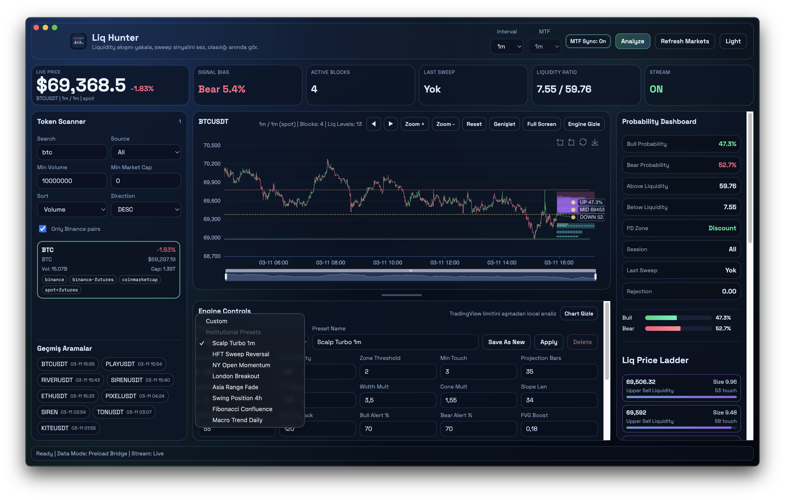
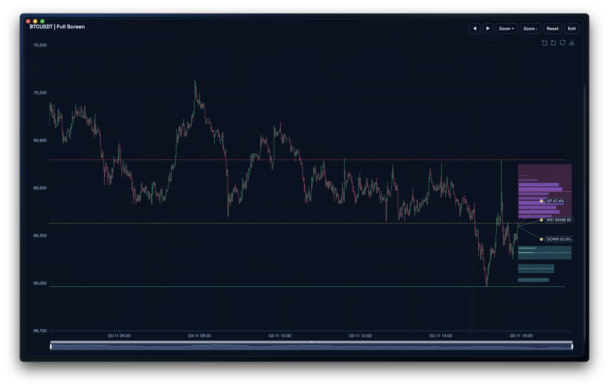
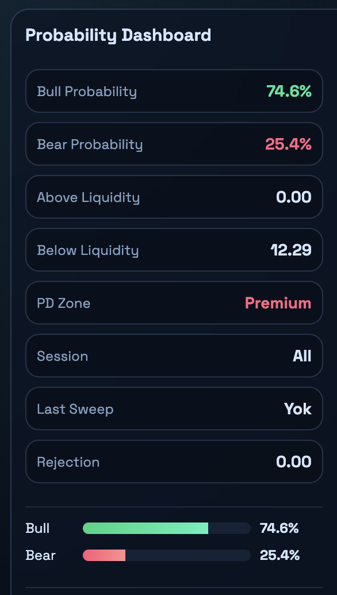
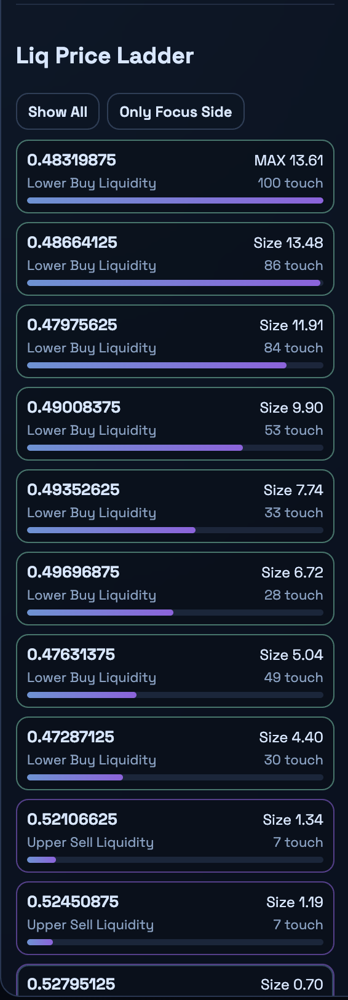
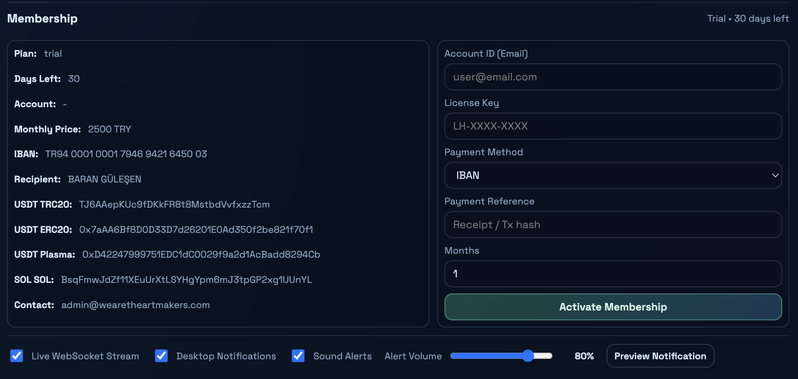

# Liq Hunter Desktop

Liq Hunter Desktop is an Electron-based trading workstation that brings a Pine-style liquidity/probability engine into a native desktop app, without TradingView script execution limits.

## Version 1 Highlights

- Unified market scanner with:
  - Binance Spot
  - Binance Futures
  - CoinGecko
  - CoinMarketCap
- Futures-only symbol visibility (for example: `SIRENUSDT`, `ARIAUSDT`)
- Token Scanner filters:
  - search
  - source
  - minimum volume
  - minimum market cap
  - sort + direction
- Liquidity visualization:
  - Liq Hunter blocks
  - Liq Price Ladder
  - liquidity level strength bars
- Probability engine dashboard:
  - bull/bear probability
  - PD zone
  - session
  - sweep/rejection state
- Live Binance kline WebSocket stream (real-time updates)
- Alerts:
  - desktop notifications
  - sound alerts
  - preview buttons for both notification and sound
- Preset system:
  - built-in institutional presets
  - custom save/apply/delete presets
- Advanced chart controls:
  - zoom/pan
  - reset
  - full-screen mode
  - chart/engine visibility toggles
- New large **live price panel** in the top area for fast monitoring
- Header logo updated to use the app icon identity

## Screenshots

### Main Dashboard


### Full-Screen Chart



### 1m Layout / Fast Monitoring View



### Probability Dashboard / Bull and Bear
<p align="left">
  
</p>

### Liq Price Ladder / Monitoring Price
<p align="left">
  
</p>

### Membership / Trial 30 days
<p align="left">
  
</p>

## Release (v1)
Release page:
- [v1](https://github.com/WeAreTheArtMakers/liqhunter/releases/tag/v1)

Assets:
- `Liq.Hunter-1.0.0-arm64-mac.zip` (macOS Apple Silicon)
- `Liq.Hunter-1.0.0-win.zip` (Windows x64)

## Local Build Commands

```bash
npm install
npm run build
npx electron-builder --mac zip
npx electron-builder --win zip --x64
```

## Distribution Model

This version is published as a test distribution:

1. 30-day trial period
2. Membership/license activation after trial
3. Tier-based feature access (Starter / Pro / Team)

## Notes

- CoinMarketCap free-plan key can be overridden with `CMC_API_KEY`.
- Repository policy is documentation + binary distribution focused.
